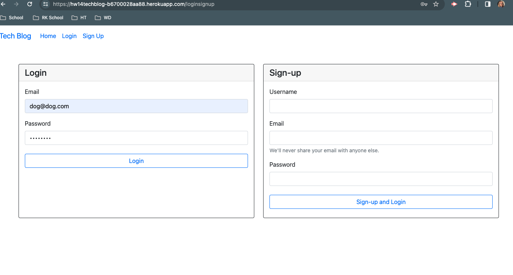

# Tech Blog

## Description

A blog to engage users to create questions, answers and conversations all about tech! 

## Table of Contents

-[How to Use](#htu)
-[Tech Blog](#tb)
-[Link to Github](#linkgithub)
-[Link to Heroku](#linkheroku)
-[Credits](#credits)

<a id="htu">
## How to Use

Just simply signup and create a post! After signing up, user is able to create posts and comment on other posts.

<a id="tb">

## Link to Github

https://github.com/thompsonholly/techblog 

<a id="linkheroku>
## Link to Heroku

https://hw14techblog-b6700028aa88.herokuapp.com/

## Credits

Created by Holly Thompson, a student attending the University of Minnesota Full Stack Coding Bootcamp.

